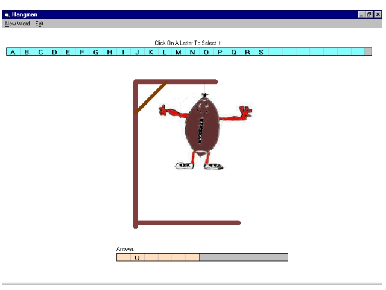



## A Hangman Program

### Description

This program allows the user to play a simple game of hangman. This program has sound and graphics (which were drawn by my wife and scanned in by me). I use the Microsoft Flex Grid Control to hold the letters and allow selection! Please vote for my code if you like it!! Thanks!
 
### More Info
 

             |
---                |---
**Submitted On**   |2001-05-08 18:42:46
**By**             |[Richard Jackson](https://github.com/Planet-Source-Code/PSCIndex/blob/master/ByAuthor/richard-jackson.md)
**Level**          |Intermediate
**User Rating**    |4.6 (23 globes from 5 users)
**Compatibility**  |VB 6\.0
**Category**       |[Games](https://github.com/Planet-Source-Code/PSCIndex/blob/master/ByCategory/games__1-38.md)
**World**          |[Visual Basic](https://github.com/Planet-Source-Code/PSCIndex/blob/master/ByWorld/visual-basic.md)
**Archive File**   |[A Hangman 19408582001\.zip](https://github.com/Planet-Source-Code/richard-jackson-a-hangman-program__1-23028/archive/master.zip)

